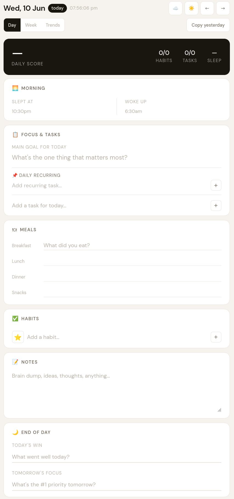
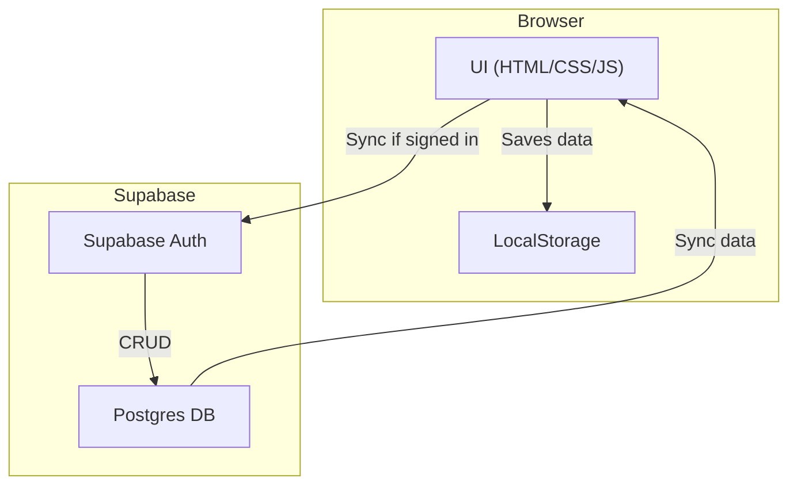

# Daily Tracker

> **[Live Demo](https://daily-trackr.netlify.app/)**

  

A lightweight, zero‑dependency in the repository personal productivity tracker that runs entirely in the browser; external libraries are loaded via CDN. Track habits, tasks, sleep, meals and daily reflections — with optional live sync via Supabase.

## Table of Contents
- [Features](#features)
- [Overview](#overview)
- [Screenshots](#screenshots)
- [Installation](#installation)
- [Running locally](#running-locally)
- [Sync setup (Supabase)](#sync-setup-supabase)
- [Project structure](#project-structure)
- [Tech stack](#tech-stack)
- [Contributing](#contributing)
- [License](#license)

## Features

- **Day view**
  - 📌 **Pinned recurring tasks** — add once, appears every day
  - ✅ **Daily tasks** — add, complete, and delete per‑day tasks
  - 😴 **Sleep tracking** — fuzzy time input (`10:30pm`, `6am`) with automatic duration and quality label
  - 🍽 **Meal log** — breakfast, lunch, dinner, snacks
  - ✅ **Habit tracker** — custom habits with emoji icons and streak counters
  - 📝 **Notes** — freeform scratchpad
  - 🌙 **End‑of‑day reflection** — daily win + tomorrow's focus
  - 📊 **Daily score** — live % based on habits, tasks, and pinned items completed

- **Week view**
  - 7‑day overview grid with per‑day scores and habit dots
  - Weekly summary: average score, days logged, best streak
  - Habit completion table with Mon–Sun breakdown

- **Trends view**
  - 30‑day score chart
  - Sleep duration chart (colour‑coded: green ≥ 7 h, amber ≥ 5 h, red < 5 h)
  - Habit completion bar chart
  - Aggregate stats: avg score, total habits done, best day

- **Other**
  - 🌗 Dark / light mode (can be toggled manually)
  - ☁️ Live Supabase cloud sync — full user authentication and automatic data sync across devices
  - 🔔 Browser notifications — daily reminders fully implemented and accurately scheduled
  - ⟳ Copy yesterday's tasks and goal to today in one click
  - 💾 Auto‑save to `localStorage` with a visible save/sync indicator and background cloud upserts
- 📥 Install button (PWA) – hidden by default; can be enabled to install the app on supported browsers

---

## Overview

The app is a single‑page web application written in vanilla HTML, CSS, and modern JavaScript (ES2020). It stores data locally in `localStorage` for a completely offline experience and can optionally sync data to a Supabase backend when the user signs in. No build step or external bundler is required – simply open `index.html` in a browser.

---
## Screenshots






---

## Installation

```bash
# Clone the repository
git clone https://github.com/jeetjawale/daily-tracker.git
cd daily-tracker
```

If you want cloud sync, copy the example Supabase config and fill in your own project values:

```bash
cp supabase-config.example.js supabase-config.js
# Edit supabase-config.js and replace the placeholders with your Supabase URL and anon key
```

---

## Running locally

```bash
# Serve the folder with any static HTTP server, e.g.:
 npx serve .
# or using Python's built‑in server
 python -m http.server 8080
```

Open `http://localhost:8080` (or the port you chose) in a browser. The app works fully offline without the `supabase-config.js` file.

---

## Sync setup (Supabase)

Live authentication and cloud sync are fully wired. To set it up on your own fork:

1. **Create a Supabase project**
   - Go to https://supabase.com and create a new project.
   - Enable **Email** in **Authentication → Providers**.
   - In the **SQL Editor**, run the provided `supabase-schema.sql` to create the required tables and RLS policies.
   - Copy the **Project URL** and **anon key** from **Project Settings → API**.
2. **Configure the app**
   - Create `supabase-config.js` from the example and paste the URL and anon key.
3. **Deploy** (optional) – push to GitHub; Netlify will automatically inject the config via the build command.

---

## Project structure

```
 daily-tracker/
 ├── index.html          # App shell and markup
 ├── style.css           # All styles (CSS custom properties, dark mode, responsive)
 ├── app.js              # Main app logic (no frameworks, no bundler)
 ├── supabase.js         # Supabase auth + sync helpers
 ├── supabase-schema.sql # Supabase schema + RLS policies
 ├── netlify.toml        # Netlify build config
 ├── supabase-config.example.js
 └── supabase-config.js  # Local/project‑specific browser config (ignored in git)
```

---

## Tech stack

| Concern | Solution |
|---|---|
| UI | Vanilla HTML + CSS (CSS custom properties) |
| Logic | Vanilla JavaScript (ES2020, no frameworks) |
| Charts | [Chart.js 4.4](https://www.chartjs.org/) via CDN |
| Sync | [Supabase Auth + Postgres](https://supabase.com) via CDN |
| Fonts | [DM Sans + DM Mono](https://fonts.google.com/) via Google Fonts |
| Hosting | [Netlify](https://netlify.com) |

---

## Contributing

Contributions are welcome! Feel free to open an issue to discuss ideas or a pull request with improvements. Please keep the project zero‑dependency philosophy in mind when proposing changes.

---

## License

MIT – do whatever you like with it.
